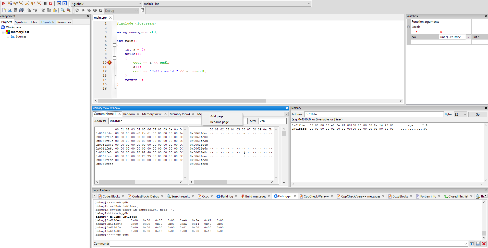
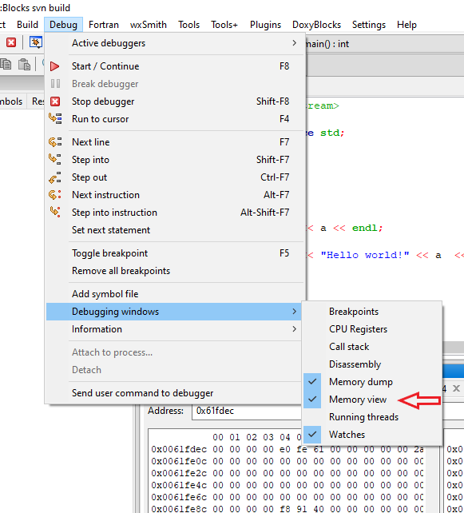

# cbMemoryView
This is a plugin for codeblocks https://www.codeblocks.org/
cbMemoryView expands the debugger plugin with an additional window, that allows to view memory from different adresses and range.
New tabs can be added and the title of the tabs can be renamed with the context menu on the tabs

## Screenshots
View of cbMemoryView integrated in codeblocks. With right click on the tabs you can rename it, and add new tabs

Detailed view of the cbMemoryView window. Enter the memory adress you want to see in the Adress field, select the size of Bytes you want to see and hit enter
The view gets updated every time the debugger stops.
The left half of the window displays the memory content in hex and the right half in ascii

cbMemoryView can be activated with the menu entry in Debug->Debugging windows->Memory view

## Installation
At the moment the plugin has to be compiled by yourself.
